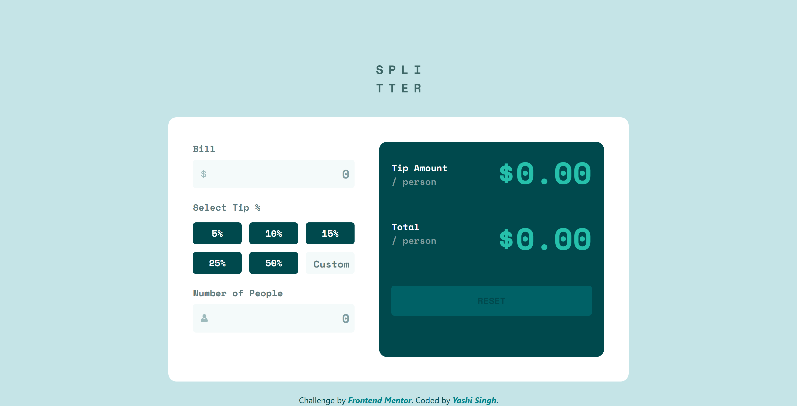
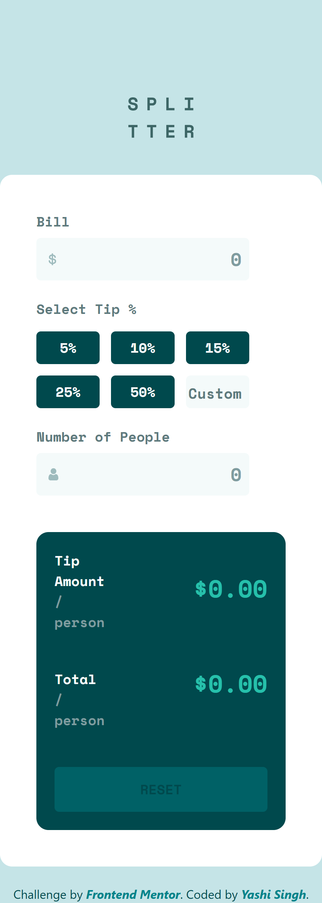

# Frontend Mentor - Tip Calculator App Solution

This is a solution to the [Tip Calculator App Challenge on Frontend Mentor](https://www.frontendmentor.io/challenges/tip-calculator-app-ugJNGbJUX). Frontend Mentor challenges help you improve your coding skills by building realistic projects.

## Table of Contents

- [Overview](#overview)
  - [The Challenge](#the-challenge)
  - [Screenshot](#screenshot)
  - [Links](#links)
- [My Process](#my-process)
  - [Built With](#built-with)
  - [What I Learned](#what-i-learned)
  - [Continued Development](#continued-development)
  - [Useful Resources](#useful-resources)
- [Getting Started](#getting-started)
  - [Installing LESS](#installing-less)
  - [Running the Project](#running-the-project)
- [Author](#author)
- [Acknowledgments](#acknowledgments)

## Overview

### The Challenge

Users should be able to:

- View the optimal layout for the app depending on their device's screen size.
- See hover states for all interactive elements on the page.
- Calculate the correct tip and total cost of the bill per person.

### Screenshot

**Desktop Design**


**Mobile Design**


### Links

- Solution URL: [Add solution URL here](https://your-solution-url.com)
- Live Site URL: [Add live site URL here](https://your-live-site-url.com)

## My Process

### Built With

- Semantic HTML5 markup
- CSS custom properties
- Flexbox
- LESS preprocessor
- Vanilla JavaScript
- Mobile-first workflow
- [Bootstrap 5](https://getbootstrap.com/) for styling.

### What I Learned

This project taught me how to effectively use the LESS preprocessor to create reusable and maintainable styles. Additionally, I enhanced my JavaScript skills by implementing dynamic calculations based on user input. For instance:

```less
@strong-cyan: hsl(172, 67%, 45%);
@very-dark-cyan: hsl(183, 100%, 15%);

input {
  border: 2px solid @very-dark-cyan;
  &:hover {
    border-color: @strong-cyan;
  }
}
```

### Continued Development

I plan to focus on improving accessibility (e.g., better handling for screen readers) and optimizing performance for larger projects in the future.

### Useful Resources

- [LESS Documentation](https://lesscss.org/) - Helped me understand LESS syntax and usage.
- [CSS-Tricks: Guide to LESS](https://css-tricks.com/less/)

## Getting Started

### Installing LESS

To work with LESS in this project, you need to install the LESS preprocessor. Follow these steps:

1. Ensure you have [Node.js](https://nodejs.org/) installed on your system.
2. Open a terminal and run the following command to install LESS globally:

   ```bash
   npm install -g less
   ```

3. Verify that LESS is installed by running:

   ```bash
   lessc --version
   ```

### Running the Project

1. Clone the project repository:

   ```bash
   git clone https://github.com/your-repo/tip-calculator.git
   cd tip-calculator
   ```

2. Compile the LESS file to CSS:

   ```bash
   lessc style.less style.css
   ```

   This command converts the `style.less` file into a standard `style.css` file.

3. Open the `index.html` file in your browser to view the project.

4. Make any updates to the `style.less` file as needed, and recompile it to see changes.

## Author

- LinkedIn - [Yashi Singh](https://www.linkedin.com/in/yashi-singh-b4143a246/)
- Frontend Mentor - [@yashi-singh](https://www.frontendmentor.io/profile/yashi-singh)

## Acknowledgments

Thanks to Frontend Mentor for the challenge, and to the developers who create amazing open-source tools like LESS!